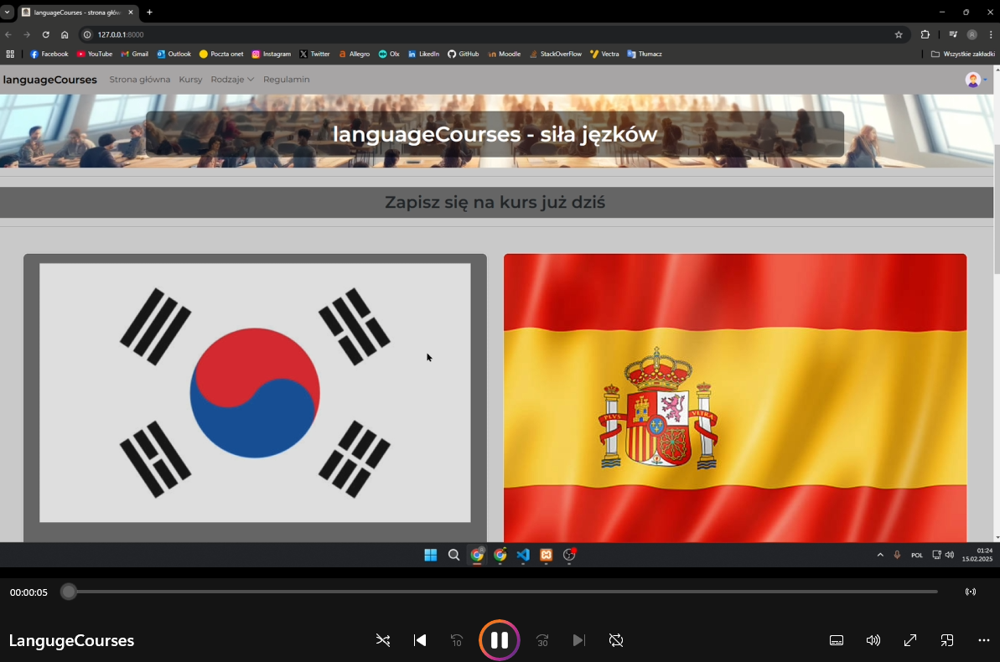

### Language Course Enrollment Platform Project

---

## Introduction

Welcome to the Language Course Enrollment Platform, a Laravel-based web application designed to simplify the process of enrolling in language courses. This platform provides users with a seamless experience to browse, compare, and enroll in language courses with ease. The project aims to enhance accessibility and user satisfaction by offering a modern, responsive, and user-friendly interface. Whether you're looking to improve your language skills or explore new ones, this platform ensures a hassle-free journey.

---

## Project Setup

### Video on youtube:

### Requirements

-   **PHP**: >= 8.1
-   **Composer**
-   **MySQL**: (MariaDB 10.6 or higher) or a compatible database
-   **Laravel**: 11.x
-   **Node.js and NPM**: For asset compilation
-   **Stripe or PayPal**: For secure online payment processing

### Installation

1. Clone the repository to your local machine.
2. Navigate to the project directory and execute `composer install` to install PHP dependencies.
3. Create a `.env` file from the `.env.example` template and configure your database and payment gateway settings.
4. Execute `php artisan key:generate` to generate the application key.
5. Execute `php artisan migrate` to create the database schema.
6. (Optional) Execute `php artisan db:seed` to populate the database with sample course data.
7. Execute `php artisan serve` to start the local development server.

---

## Features

-   **User Registration and Authentication**: Secure system for users to sign up, log in, and manage their profiles.
-   **Course Catalog**: A detailed listing of language courses with information on schedules, prices, and course descriptions.
-   **Flexible Enrollment Options**: Users can enroll in courses directly through the platform.
-   **Payment Processing**: Secure integration with Stripe or PayPal to handle payments.
-   **User Dashboard**: Access enrolled courses, manage schedules, and view payment history.
-   **Administrative Panel**: Admins can manage courses, schedules, prices, and monitor user activity and transactions.
-   **Responsive Design**: Optimized for both desktop and mobile devices to ensure accessibility.

---

## Technologies

-   **Laravel 11.x**: A robust PHP framework for web application development.
-   **MySQL/MariaDB**: For efficient and reliable data storage.
-   **Stripe/PayPal**: To securely process payments.
-   **Bootstrap 5**: Ensuring a modern and responsive UI/UX.

---

## About Laravel

Laravel is a versatile framework known for its elegant syntax and comprehensive feature set. This project leverages Laravel's features for routing, database ORM (Eloquent), and Blade templating engine, making development efficient and enjoyable.

For further learning, explore the official [Laravel documentation](https://laravel.com/docs) or tutorials on [Laracasts](https://laracasts.com).

---

## License

The Language Course Enrollment Platform is licensed under the [MIT License](https://opensource.org/licenses/MIT).
