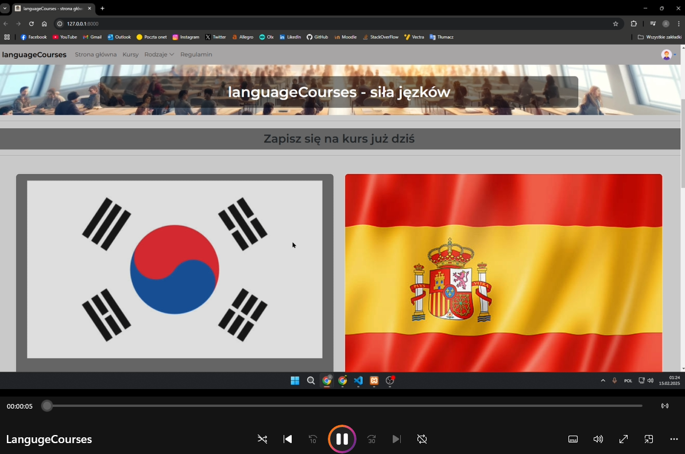

# Language-Course-Enrollment-Platform 

> 🚀 **Modern Language Learning Platform** - Build comprehensive course enrollment systems with Laravel, secure payments, and responsive design

## 📋 Description

Welcome to the **Language Course Enrollment Platform** repository! This Laravel-based web application simplifies the process of browsing, comparing, and enrolling in language courses. The platform provides users with a seamless experience featuring modern authentication, secure payment processing, and comprehensive course management capabilities.

This project demonstrates best practices in Laravel development, including Eloquent ORM, Blade templating, RESTful API design, and secure payment gateway integration. Whether students are looking to improve language skills or explore new ones, this platform ensures a hassle-free and engaging learning journey.

## � Quick Start with Docker (Recommended)

The easiest way to run this project is using Docker. Everything is automated!

### Prerequisites

- Docker Desktop or Docker Engine
- Docker Compose

### One-Command Setup

```bash
cd .tools/docker
docker compose up -d --build
```

That's it! 🎉 The setup automatically:

- ✅ Installs all PHP dependencies (Composer)
- ✅ Installs all Node.js dependencies (NPM)
- ✅ Builds frontend assets
- ✅ Generates application key
- ✅ Runs database migrations
- ✅ Seeds database with test data
- ✅ Generates course images
- ✅ Sets appropriate permissions

### Access Points

After starting Docker containers:

- **Application**: http://localhost:8001
- **phpMyAdmin**: http://localhost:8081
    - Server: `db`
    - Username: `languagecourses`
    - Password: `secret`

### Docker Management Commands

```bash
# Stop containers
docker compose down

# View logs
docker compose logs -f app

# Restart containers
docker compose restart

# Rebuild from scratch
docker compose down -v
docker compose up -d --build
```

For more Docker commands and troubleshooting, see [Docker Documentation](.tools/docker/README.md).

---

## �📁 Repository Structure

```

Language-Course-Enrollment-Platform/
├── 📁 app/
│ ├── 🎮 Http/
│ │ ├── Controllers/ # Application controllers
│ │ └── Middleware/ # HTTP middleware
│ ├── 📦 Models/ # Eloquent ORM models
│ └── 🔧 Services/ # Business logic services
├── 📁 database/
│ ├── 🌱 seeders/ # Database seeders
│ ├── 🔄 migrations/ # Database migrations
│ └── 🏭 factories/ # Model factories
├── 📁 resources/
│ ├── 📄 views/ # Blade templates
│ ├── 🎨 css/ # Stylesheets
│ └── 💻 js/ # JavaScript assets
├── 📁 routes/
│ ├── 🌐 web.php # Web routes
│ └── 🔌 api.php # API routes
├── 📁 public/ # Public assets and entry point
├── 📁 config/ # Application configuration
├── ⚙️ .env.example # Environment configuration template
├── 📦 composer.json # PHP dependencies
├── 📦 package.json # Node.js dependencies
└── 📖 README.md # Project documentation

```

## 🚀 Getting Started

### Option 1: Docker (Recommended) 🐳

See the [Quick Start with Docker](#-quick-start-with-docker-recommended) section above.

### Option 2: Manual Installation

#### 1. Clone the Repository

```bash
git clone https://github.com/dawidolko/Language-Course-Enrollment-Platform.git
cd Language-Course-Enrollment-Platform
```

#### 2. Install Dependencies

```bash
# Install PHP dependencies
composer install

# Install Node.js dependencies
npm install
```

#### 3. Environment Configuration

```bash
# Create environment file
cp .env.example .env

# Generate application key
php artisan key:generate

# Configure your database and payment gateway settings in .env file
```

#### 4. Database Setup

```bash
# Run database migrations
php artisan migrate

# (Optional) Seed database with sample data
php artisan db:seed
```

#### 5. Compile Assets

```bash
# Compile frontend assets
npm run dev

# Or for production
npm run build
```

#### 6. Start Development Server

```bash
# Start Laravel development server
php artisan serve
```

- Access the application at [http://localhost:8000](http://localhost:8000)

## ⚙️ System Requirements

### **Essential Tools:**

- **PHP** (version 8.1 or higher)
- **Composer** for PHP dependency management
- **MySQL** or **MariaDB** (10.6 or higher)
- **Node.js** and **NPM** for asset compilation
- **Git** for version control

### **Development Environment:**

- **Laravel** (version 11.x)
- **Code Editor** (VS Code, PhpStorm, Sublime Text)
- **Web Server** (Apache, Nginx, or Laravel built-in server)
- **Database Management Tool** (phpMyAdmin, MySQL Workbench)

### **Payment Gateway:**

- **Stripe** or **PayPal** account for payment processing
- Valid API credentials configured in `.env` file

### **Recommended Extensions:**

- **Laravel** syntax highlighting and IntelliSense
- **Blade** template support
- **PHP Intelephense** for code completion
- **Prettier** for code formatting
- **ESLint** for JavaScript code quality

### **Laravel Ecosystem:**

- **Eloquent ORM** for database operations
- **Blade Templating Engine** for views
- **Laravel Mix** or **Vite** for asset compilation
- **Laravel Sanctum** for API authentication

## ✨ Key Features

### **👤 User Management**

- Secure registration and authentication system
- Personal user dashboard with profile management
- Access to enrolled courses and learning progress tracking

### **📚 Course Catalog**

- Comprehensive listing of language courses
- Detailed course descriptions with schedules and pricing
- Advanced search and filtering capabilities
- Course comparison functionality

### **💳 Payment Processing**

- Secure integration with Stripe and PayPal
- Multiple payment method support
- Transaction history and receipt generation
- Automated enrollment confirmation

### **🎓 Enrollment System**

- Flexible course enrollment options
- Real-time availability checking
- Schedule conflict detection
- Automated email notifications

### **⚙️ Administrative Panel**

- Complete course management (CRUD operations)
- User activity monitoring and analytics
- Transaction oversight and reporting
- Schedule and pricing management

### **📱 Responsive Design**

- Fully optimized for desktop, tablet, and mobile devices
- Modern Bootstrap 5 UI components
- Intuitive navigation and user experience
- Accessibility-compliant interface

## 🛠️ Technologies Used

- **Laravel 11.x** - Robust PHP framework with elegant syntax
- **MySQL/MariaDB** - Reliable relational database management
- **Stripe/PayPal** - Secure payment gateway integration
- **Bootstrap 5** - Modern responsive frontend framework
- **Blade** - Laravel's powerful templating engine
- **Eloquent ORM** - Intuitive database interaction
- **Composer** - PHP dependency management
- **NPM** - Node.js package management

## 🌍 Live Demo

The project video demonstration is available on YouTube:

[](https://youtu.be/Rjnw00AN1Xw)

## 📚 Learning Resources

### **Laravel Documentation:**

- Official [Laravel Documentation](https://laravel.com/docs)
- [Laracasts](https://laracasts.com) - Video tutorials and courses

### **Additional Resources:**

- [Laravel News](https://laravel-news.com) - Latest updates and articles
- [Laravel Daily](https://laraveldaily.com) - Tips and tricks

## 🤝 Contributing

Contributions are highly welcomed! Here's how you can help:

- 🐛 **Report bugs** - Found an issue? Let us know!
- 💡 **Suggest improvements** - Have ideas for better features?
- 🔧 **Submit pull requests** - Share your enhancements and solutions
- 📖 **Improve documentation** - Help make the project clearer

Feel free to open issues or reach out through GitHub for any questions or suggestions.

## 👨‍💻 Author

Created by **Dawid Olko** - Part of the Laravel web development series.

## 📄 License

This project is open source and available under the [MIT License](https://opensource.org/licenses/MIT).

---
